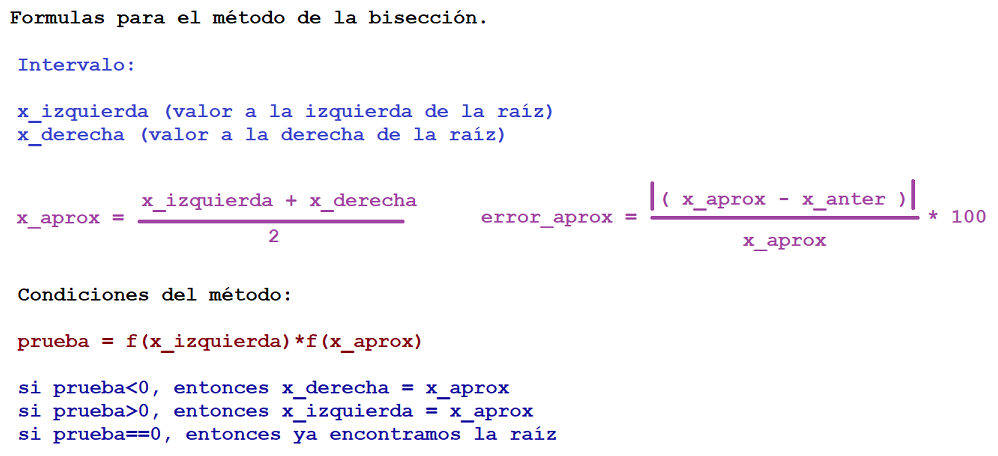

## Método de la bisección.

*Es un algoritmo iterativo que se usa para encontrar raíces de una función en un intervalo dado.*

**El truco debajo de éste método es el teorema del valor intermedio.**

> Prueba para saber si existe una raíz dentro de un intervalo cerrado [a,b]:

```
x=1 y x=2.

f(x) = x^2 - 2

f(1) = 1 - 2 = -1 < 0
f(2) = 4 - 2 = 2 > 0

f(1)*f(2)=-2 < 0 signos diferentes.

```

Por esta razón sabemos que hay una raíz entre x=1 y x=2, ya que hubo un cambio de signo.

> Formulas del método de la bisección:



