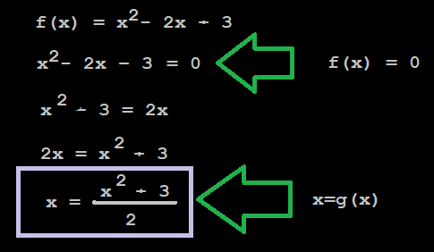

## Punto fijo.

*El método del punto fijo es un algoritmo iterativo, utiliza la soluciones de una ecuaciones de la forma f(x)=x. Este método se basa en la idea de que si hay un punto fijo, con cada iteración el valor la x aproximada se irá acercando al punto fijo.*

> Pasos a seguir:

1. Buscamos despejar 'x' de una ecuación f(x)=0, de tal manera que obtegamos una ecuación de la forma x=g(x).

2. Evaluamos x_aprox = g(x_anterior), x_anterior se inicializa en 0.

3. Calcular el error aproximado.

> Ejemplos del paso 1:

